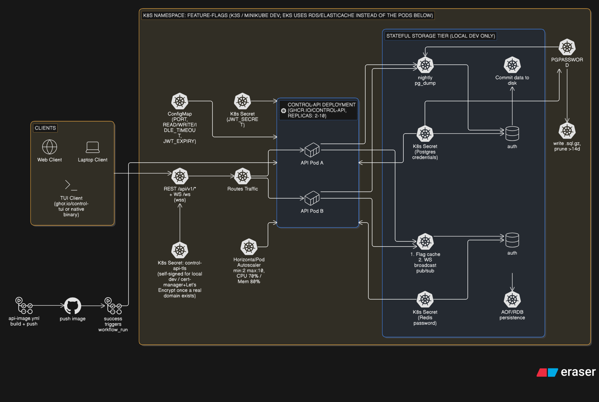
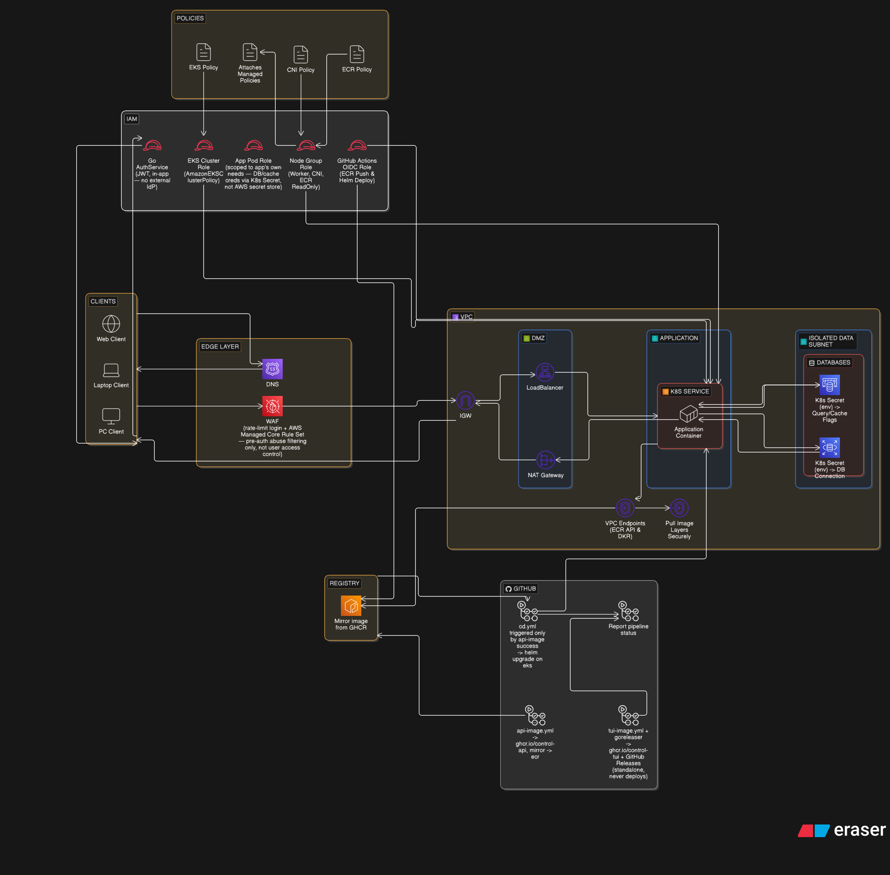

# control

  

## Description
A Feature Flag service, self hosted or AWS cloud native.

## Currently it supports 
- RBAC authorization natively
- TUI client so it can work on servers locally without needing a display env or compositor (and to cut cloud costs)
- You can only sign from the register endpoint, so you can't create an account from TUI to prevent dummy projects from existing (mostly, you still can use a regular client like **curl** or **postman** to create them like the demo)
- Every CRUD operation is done throught a **REST** endpoint, the real-time feature is done through a **Websocket** endpoint
- You can control **rollout percentage** (increase/decrease by only 5% at a time)
- Flag state is visible depending on time (unchanged for so long or not)
- Only one admin per project, to prevent collisions
- Deployable on **AWS Cloud** or locally on an **on-premise** server 
- Supports **TLS** termination on the api layer (not end-to-end)
- All data are backed up regularly (configurable)

> **Note:** If you want to fork this project make sure to configure the secrets on your behalf as well

## Diagrams

### 1. Kubernetes Diagram 


You can find the **eraser.io** diagram code here [k8s Diagram Text](assets/txt/k8s-diagram.txt).

### 2. AWS Cloud Diagram 


You can find the **eraser.io** diagram code here [AWS Cloud Diagram Text](assets/txt/aws-cloud-diagram.txt).

# Setup Guide (for local dev & demo) 
### Control API on Minikube (NodePort)

## Prerequisites

- Go v1.26.4 or higher (or docker if you prefer)
- Git
- Helm v3.19.0
- minikube v1.38.1 (for local dev)
- docker v29.6.1 (client + server)  
- Terraform v1.15.6

## Used Packages 

- [charmbracelet/bubbles](https://github.com/charmbracelet/bubbletea)
- [charmbracelet/bubbletea](https://github.com/charmbracelet/bubbles)
- [charmbracelet/lipgloss](https://github.com/charmbracelet/lipgloss)
- [gorilla/websocket](https://github.com/gorilla/websocket)
- [golang-jwt/jwt/v5](https://github.com/golang-jwt/jwt)
- [google/uuid](https://github.com/google/uuid)
- [jackc/pgx/v5](https://github.com/jackc/pgx)
- [redis/go-redis/v9](https://github.com/redis/go-redis)
- [golang.org/x/crypto](https://golang.org/x/crypto)

## Project Tree

```bash
control
├── api   # Application internal logic & api
│   ├── cmd
│   │   ├── app
│   │   │   └── main.go
│   │   └── model
│   │       └── model.go
│   ├── Dockerfile
│   ├── go.mod
│   ├── go.sum
│   ├── internal
│   │   ├── broadcast
│   │   │   └── broadcast.go
│   │   ├── config
│   │   │   └── config.go
│   │   ├── hub
│   │   │   └── hub.go
│   │   ├── server
│   │   │   ├── midlleware.go
│   │   │   ├── rest.go
│   │   │   └── server.go
│   │   ├── service
│   │   │   ├── auth.service.go
│   │   │   ├── flag.service.go
│   │   │   ├── project.service.go
│   │   │   └── user.service.go
│   │   └── store
│   │       ├── db.go
│   │       ├── momory.go
│   │       └── store.go
│   └── pkgs
│       └── clients
│           └── tui
│               └── tui.client.go
├── assets
│   ├── images
│   │   ├── aws-cloud-diagram.png
│   │   └── k8s-diagram.png
│   └── txt
│       ├── aws-cloud-diagram.txt
│       └── k8s-diagram.txt
├── deploy    # Helm chart
│   └── helm
│       └── control-api
│           ├── templates
│           │   ├── backup-cronjob.yaml
│           │   ├── backup-pvc.yaml
│           │   ├── configmap.yaml
│           │   ├── deployment.yaml
│           │   ├── _helpers.tpl
│           │   ├── hpa.yaml
│           │   ├── ingressroute.yaml
│           │   ├── middleware.yaml
│           │   ├── networkpolicy.yaml
│           │   ├── sercret.yaml
│           │   └── service.yaml
│           ├── Chart.yaml
│           └── values.yaml
├── docker-compose.test.yml
├── docker-compose.yaml
├── go.work
├── go.work.sum
├── LICENSE
├── README.md
├── terraform  # Iac
│   ├── main.tf
│   ├── modules
│   │   ├── caching
│   │   │   ├── main.tf
│   │   │   ├── outputs.tf
│   │   │   └── variables.tf
│   │   ├── compute
│   │   │   ├── ecr.tf
│   │   │   ├── eks.tf
│   │   │   ├── outputs.tf
│   │   │   └── variables.tf
│   │   ├── data
│   │   │   ├── main.tf
│   │   │   ├── outputs.tf
│   │   │   └── variables.tf
│   │   ├── edge
│   │   │   ├── oidc.tf
│   │   │   ├── outputs.tf
│   │   │   ├── variables.tf
│   │   │   └── waf.tf
│   │   ├── security
│   │   │   ├── main.tf
│   │   │   ├── outputs.tf
│   │   │   └── variables.tf
│   │   └── vpc
│   │       ├── main.tf
│   │       ├── outputs.tf
│   │       └── variables.tf
│   ├── outputs.tf
│   ├── providers.tf
│   ├── README.md
│   └── variables.tf
├── shared    # Shared module between api and tui
│   ├── go.mod
│   └── types.go
├─ tui  # The Tui client
│   ├── cmd
│   │   └── app
│   │       ├── app.go
│   │       └── main.go
│   ├── Dockerfile
│   ├── go.mod
│   ├── go.sum
│   ├── pkgs
│   │   └── client
│   │       └── client.go
│   ├── styles
│   │   └── styles.go
│   ├── types
│   │   └── user.types.go
│   └── views
│       ├── flags.view.go
│       ├── project.view.go
│       └── users.view.go
├── .github           # Workflows directory
│   ├── ISSUE_TEMPLATE          # Issue templates
│   │   ├── bug_report.md
│   │   ├── config.yaml
│   │   ├── custom_issue.md
│   │   └── feature_request.md
│   ├── custom_pull_request.md   # PR template
│   └── workflows
│       ├── ci.yaml   # Continuous integration workflow file
│       ├── api-image.yaml # Build and push to GHCR 
│       ├── tui-image.yaml # Build and push to GHCR 
│       └── discord-notify.yaml 
└── .gitignore
```

## On Local Change
### Build modules after any changes:

```bash
# Build specific modules
go build ./api/cmd
go build ./tui/cmd
go build ./...          # for shared packages

# Rebuild Docker images
docker build -f api/Dockerfile -t control-api:latest . --network=host
docker build -f tui/Dockerfile -t control-tui:latest . --network=host
```

## Local Setup With Minikube

### 1. Start Minikube

```bash
minikube start --driver=docker --cpus=4 --memory=8192
```

### 2. Load Images (for pullPolicy: Never)

```bash
minikube image load bitnami/postgresql:latest
minikube image load bitnami/redis:latest
minikube image load control-api:latest
```

### 3. Self-Signed TLS Certificate (for dev only)
```bash
openssl req -x509 -newkey rsa:2048 -nodes -keyout tls.key -out tls.crt -days 365 -subj "/CN=control.local" -addext "subjectAltName=DNS:control.local"

kubectl create secret tls control-api-tls --cert=tls.crt --key=tls.key
```

### 4. Install Traefik CRDs

```bash 
kubectl apply -f https://raw.githubusercontent.com/traefik/traefik/v3.1/docs/content/reference/dynamic-configuration/kubernetes-crd-definition-v1.yml
```

### 5. Install Traefik 

```bash 
helm repo add traefik https://traefik.github.io/charts
helm repo update
helm install traefik traefik/traefik
```

### 6. Wait for traefik pod to be ready

```bash
kubectl wait --for=condition=ready pod -l app.kubernetes.io/name=traefik --timeout=90s
```

### 7. Create Secrets

```bash
kubectl create secret generic control-postgres-secret \
  --from-literal=password=$(openssl rand -hex 16)

kubectl create secret generic control-redis-secret \
  --from-literal=password=$(openssl rand -hex 16)
```

### 8. Install Control API

```bash
helm install control deploy/helm/control-api \
  --set api.jwtSecret=$(openssl rand -hex 32) \
  --set api.image.repository=control-api \
  --set api.image.tag=latest \
  --set api.image.pullPolicy=Never \
  --set postgresql.image.registry="" \
  --set postgresql.image.repository=bitnami/postgresql \
  --set postgresql.image.tag=latest \
  --set postgresql.image.pullPolicy=Never \
  --set redis.image.registry="" \
  --set redis.image.repository=bitnami/redis \
  --set redis.image.tag=latest \
  --set redis.image.pullPolicy=Never \
  --set service.type=NodePort \
  --set service.nodePort=32405
```

### 9. Get API URL

```bash
minikube service control-control-api --url
# Output Example: http://192.168.49.2:32405
```

### 10. API Workflow

```bash
# 1. Register app
# Check the port here, use the same port & IP in the 9th step
RESPONSE=$(curl -s "http://$(minikube ip):32405/api/v1/register-app" \
  -H "Content-Type: application/json" \
  -d '{"app_name":"Testing"}' | jq .)

echo "$RESPONSE" | jq .

# 2. Extract credentials
ADMIN_USER=$(echo "$RESPONSE" | jq -r '.admin_username')
ADMIN_PASS=$(echo "$RESPONSE" | jq -r '.admin_password')

echo "Admin: $ADMIN_USER"
echo "Password: $ADMIN_PASS"

# 3. Login

TOKEN=$(curl -s "http://$(minikube ip):32405/api/v1/login" \
  -H "Content-Type: application/json" \
  -d "{\"username\":\"$ADMIN_USER\",\"password\":\"$ADMIN_PASS\"}" | jq -r '.token')

echo "Token: $TOKEN"

# 4. Create flag
# <initial rollout percentage> value must not be inside quotes
curl -s "http://$(minikube ip):32405/api/v1/flag/create" \
  -H "Authorization: Bearer $TOKEN" \
  -H "Content-Type: application/json" \
  -d '{"name":"<flag-name>","description":"<flag description>","status":"< "OFF" or "ON" >,"rollout":<initial rollout percentage>}' | jq .
```

> Note: The TUI is for managing existing projects/flags, not registering new apps. Register via curl first (or make your api request via your own project), then use those credentials in the TUI.

### 11. Run the TUI container

```bash
docker run --rm -it --network=host control-tui:latest
```

### 12. Tui 

In the TUI, use the API URL from step 9 & the username/password from step 10.2

```plain
# Example
API URL: http://192.168.49.2:32405
Username: <admin_username from register-app>
Password: <admin_password from register-app>
```

## Confirmations 

### Confirm TLS Certificate Existence 
```bash 
kubectl get secret control-api-tls
# Example Output
# NAME              TYPE                DATA   AGE
# control-api-tls   kubernetes.io/tls   2      34m

kubectl get secret control-api-tls -o jsonpath='{.data.tls\.crt}' | base64 -d | openssl x509 -noout -text | head -20
# Example Output
Certificate:
#    Data:
#        Version: 3 (0x2)
#        Serial Number:
#            0d:af:09:8b:7e:e5:64:b9:86:25:6e:9e:9b:14:f8:f7:6e:fb:5b:ca
#        Signature Algorithm: sha256WithRSAEncryption
#        Issuer: CN=control.local
#        Validity
#            Not Before: Jul 10 08:30:40 2026 GMT
#            Not After : Jul 10 08:30:40 2027 GMT
#        Subject: CN=control.local
#        Subject Public Key Info:
#            Public Key Algorithm: rsaEncryption
#                Public-Key: (2048 bit)
#                Modulus:
#                    00:b4:9b:a5:29:e8:f6:97:de:38:9c:ba:7c:e3:87:
#                    6b:aa:39:8a:a4:ef:31:8f:51:82:0e:e1:3d:2d:1f:
#                    a0:34:1f:8f:2c:99:fe:1b:a9:8c:af:1c:2e:34:fa:
#                    2b:ec:63:d1:99:59:e6:73:81:82:61:34:60:9d:f2:
#                    d3:9c:3d:d9:4a:8d:f8:f2:91:35:28:cd:f5:1f:be:

# If your traefik service is in another namespace, make sure to use it
kubectl get svc -n default traefik
# Example Output
# NAME      TYPE           CLUSTER-IP      EXTERNAL-IP     PORT(S)                      AGE
# traefik   LoadBalancer   10.102.59.208   10.102.59.208   80:31051/TCP,443:32127/TCP   45m
# If your external IP exists (not - or "PENDING") then you're good to go

kubectl get svc -n default traefik -o jsonpath='{.spec.ports}' | jq .
# Example Output
# [
#  {
#    "name": "web",
#    "nodePort": 31051,
#    "port": 80,
#    "protocol": "TCP",
#    "targetPort": "web"
#  },
#  {
#    "name": "websecure",
#    "nodePort": 32127,
#    "port": 443,
#    "protocol": "TCP",
#    "targetPort": "websecure"
#  }
#]
# Make sure the "wesecure port" exits since we need it

kubectl describe ingressroute control-control-api

# Name:         control-control-api
# Namespace:    default
# Labels:       app.kubernetes.io/managed-by=Helm
# Annotations:  meta.helm.sh/release-name: control
#               meta.helm.sh/release-namespace: default
# API Version:  traefik.io/v1alpha1
# Kind:         IngressRoute
# Metadata:
#   Creation Timestamp:  2026-07-10T08:33:32Z
#   Generation:          1
#   Resource Version:    1440
#   UID:                 e98dc8f1-57d1-42a1-a8c8-945edab9c8dd
# Spec:
#   Entry Points:
#     websecure
#   Routes:
#     Kind:   Rule
#     Match:  Host(`control.local`)
#     Services:
#       Name:               control-control-api
#       Port:               80
#       Servers Transport:  control-control-api-transport
#   Tls:
#     Secret Name:  control-api-tls
# Events:           <none>
# Ensure that the entrypoint is "websecure", the host is 'control.local' and the TLS secret Name matches what is in the values file

# Parse the Nodeport of the websecure port
NODEPORT=$(kubectl get svc -n default traefik -o jsonpath='{.spec.ports[?(@.name=="websecure")].nodePort}')

echo "NodePort: $NODEPORT"
curl -kv https://control.local:"$NODEPORT"/health --resolve control.local:"$NODEPORT":$(minikube ip)
# Example Output
# * Added control.local:32127:192.168.49.2 to DNS cache
# * Hostname control.local was found in DNS cache
# * Host control.local:32127 was resolved.
# * IPv6: (none)
# * IPv4: 192.168.49.2
# *   Trying 192.168.49.2:32127...
# * ALPN: curl offers h2,http/1.1
# * TLSv1.3 (OUT), TLS handshake, Client hello (1):
# * SSL Trust: peer verification disabled
# * TLSv1.3 (IN), TLS handshake, Server hello (2):
# * TLSv1.3 (IN), TLS change cipher, Change cipher spec (1):
# * TLSv1.3 (IN), TLS handshake, Encrypted Extensions (8):
# * TLSv1.3 (IN), TLS handshake, Certificate (11):
# * TLSv1.3 (IN), TLS handshake, CERT verify (15):
# * TLSv1.3 (IN), TLS handshake, Finished (20):
# * TLSv1.3 (OUT), TLS change cipher, Change cipher spec (1):
# * TLSv1.3 (OUT), TLS handshake, Finished (20):
# * SSL connection using TLSv1.3 / TLS_AES_128_GCM_SHA256 / X25519MLKEM768 / RSASSA-PSS
# * ALPN: server accepted h2
# * Server certificate:
# *   subject: CN=control.local
# *   start date: Jul 10 08:30:40 2026 GMT
# *   expire date: Jul 10 08:30:40 2027 GMT
# *   issuer: CN=control.local
# *   Certificate level 0: Public key type RSA (2048/112 Bits/secBits), signed using sha256WithRSAEncryption
# * OpenSSL verify result: 12
# *  SSL certificate verification failed, continuing anyway!
# * Established connection to control.local (192.168.49.2 port 32127) from 192.168.49.1 port 41042
# * using HTTP/2
# * [HTTP/2] [1] OPENED stream for https://control.local:32127/health
# * [HTTP/2] [1] [:method: GET]
# * [HTTP/2] [1] [:scheme: https]
# * [HTTP/2] [1] [:authority: control.local:32127]
# * [HTTP/2] [1] [:path: /health]
# * [HTTP/2] [1] [user-agent: curl/8.21.0]
# * [HTTP/2] [1] [accept: */*]
# > GET /health HTTP/2
# > Host: control.local:32127
# > User-Agent: curl/8.21.0
# > Accept: */*
# >
# * Request completely sent off
# * TLSv1.3 (IN), TLS handshake, Newsession Ticket (4):
# < HTTP/2 200
# < access-control-allow-headers: Content-Type, Authorization
# < access-control-allow-methods: GET, POST, PUT, PATCH, DELETE, OPTIONS
# < access-control-allow-origin: *
# < content-type: application/json
# < date: Fri, 10 Jul 2026 09:21:39 GMT
# < content-length: 38
# <
# {"status":"healthy","websocket":true}
# * Connection #0 to host control.local:32127 left intact

# make sure that the status is healthy
```

### Alternative

You can use *host.docker.internal* with *port-forward*:

```bash
kubectl port-forward svc/control-control-api 8080:80 --address=0.0.0.0
```

Then TUI URL: http://host.docker.internal:8080

The rest is the same

## Troubleshooting

| Issue                           | Fix                                                        |
| ------------------------------- | ---------------------------------------------------------- |
| `service has no node port`      | Ensure `--set service.type=NodePort` is in install command |
| `port already allocated`        | Pick a different `nodePort` (30000-32767)                  |
| TUI can't reach API             | Verify `--network=host` is used when running TUI container |
| `invalid authorization format`  | Ensure `Bearer $TOKEN` header is set correctly             |
| Stale images after code changes | Re-run `go build` and `docker build` steps at top          |

## AWS + Terraform 
If you want to deploy it on the cloud (only AWS is supported for now), don't forget to configure your profile or use your credentials locally
```bash 
nvim ~/.aws/credentials 

# Which should contain 
# [default]
# aws_access_key_id = <your-key-id> 
# aws_secret_access_key = <your-secret>
```

Then you can 
```bash 
# If you changed anything in the tf files, make sure to format them (it's optional but recommended)
terraform fmt -recursive

# Validate to make sure there are no errors
terraform validate

# Then proceed with planning
terraform plan

# If you're ready to deploy, then 
terraform apply
```

# Contributions 
We currently accept contributions, but we don't mind if you fork this repo and build on top of it, so feel free to do so.
